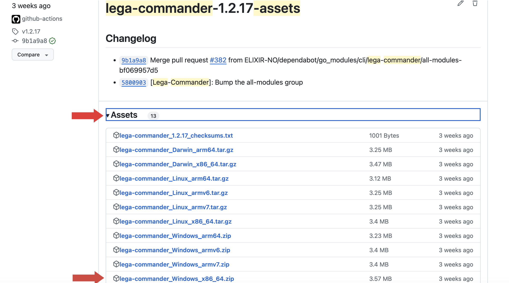
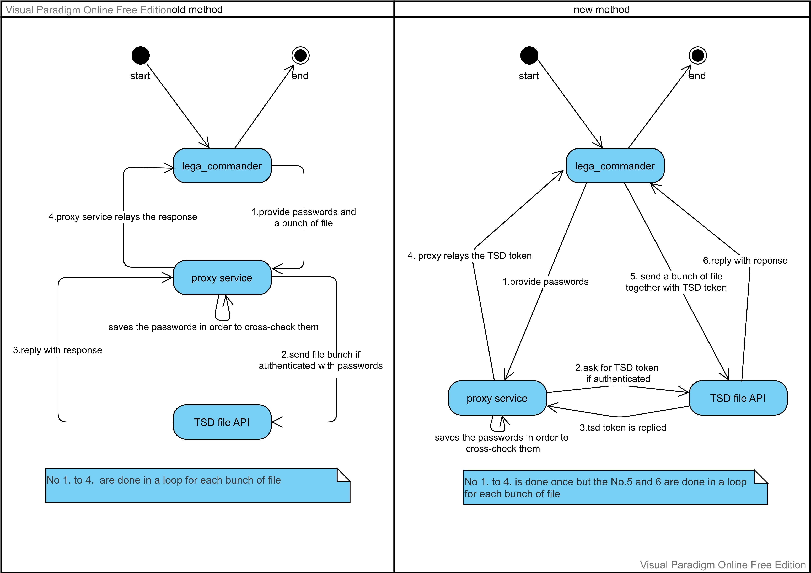

# lega-commander

## Installation / Update

### Manual Installation (Linux/macOS)

1. **Download** the appropriate tarball for your operating system from the [releases page](https://github.com/ELIXIR-NO/FEGA-Norway/releases?q=lega-commander-*-assets).
2. **(Optional) Verify** the file’s checksum using the checksum file provided in the same release.
3. **Extract** the tarball (e.g., `tar -xzf <filename>.tar.gz`).
4. **Move** the extracted binary (`lega-commander`) to a folder in your system’s PATH.

**For example:**

**Option 1:** Install system-wide (requires `sudo`):
   ```
   sudo cp lega-commander /usr/local/bin/
   sudo chmod +x /usr/local/bin/lega-commander
   ```
**Option 2:**  Install for the current user (no `sudo` required):
   ```
   mkdir -p ~/.local/bin
   cp lega-commander ~/.local/bin/
   chmod +x ~/.local/bin/lega-commander
   ```
**Note:** Ensure ~/.local/bin is in your PATH.

### Windows
1. Go to the [releases page](https://github.com/ELIXIR-NO/FEGA-Norway/releases?q=lega-commander-*-assets).
2. The latest **lega-commander** release should be at the top of the page.
3. Under the release title, locate the **"Assets"** section.
4. Click on **"Assets"** (or the small arrow next to it) to expand the list.
   
5. In the expanded list, look for the file named **Windows_x86_64.zip** (or the version that matches your system).
6. Click on the file to start the download.
7. You can now execute `lega-commander.exe` from the extracted folder.

### Automated Installation
#### Linux
Run the command below on your terminal:
```
curl -fsSL https://raw.githubusercontent.com/ELIXIR-NO/FEGA-Norway/main/cli/lega-commander/install.sh | sudo sh
```

#### MacOS
Run the command below on your terminal:
```
curl -fsSL https://raw.githubusercontent.com/ELIXIR-NO/FEGA-Norway/main/cli/lega-commander/install.sh | sh
```


#### This script:
1. Detects your OS and architecture.
2. Fetches the latest (or specified) version of lega-commander from the GitHub releases.
3. Verifies the downloaded binary against a checksum to ensure integrity.
4. Extracts the binary and installs it to a suitable system directory (e.g., /usr/local/bin or $HOME/.local/bin).
5. Removes temporary files and confirms a successful installation.


#### Advanced Installation Options

The installation script (`install.sh`) provides several options to customize the installation process.
```
Usage: $this [-b bindir] [-t tag] [-d] [-h]
  -b  Sets bindir or installation directory (defaults to /usr/local/bin).
  -t  Sets a specific tag (e.g., "vX.Y.Z") to install.
  -d  Turns on debug logging (if available).
  -h  Displays this help message.

If no tag is specified, the latest release from:
  https://github.com/ELIXIR-NO/FEGA-Norway/releases
will be installed.
```


## Configuration
Before using the lega commander, make sure all the environment variables required for authentication are set:
>In linux and MacOS you can use below commands in commandlines  to set them:
>
>```
>export CENTRAL_EGA_USERNAME=...
>export CENTRAL_EGA_PASSWORD=...
>export ELIXIR_AAI_TOKEN=...
>```

> In windows, the variables must be set in environmental variables list.(Explained [here](https://www.architectryan.com/2018/08/31/how-to-change-environment-variables-on-windows-10/))

Table below shows how there variables must be set:
| Environmental variable name        | description
|-------------------                | -------------
|CENTRAL_EGA_USERNAME               | The user name that you received from [CEGA website](https://ega-archive.org/)
|CENTRAL_EGA_PASSWORD               | The password that you received from [CEGA website](https://ega-archive.org/)
|ELIXIR_AAI_TOKEN                   | The token that you received after login here:(https://ega.elixir.no/)


>for developers: the tool is pre-configured to work with 
 Norwegian Federated EGA instance: https://ega.elixir.no.
 If you want to specify another instance, you can set `LOCAL_EGA_INSTANCE_URL` environment variable. 


## Usage

> For the time being, all of **upload** and **download** commands **should** not run with `-b` argument.
```
$ lega-commander
lega-commander [inbox | outbox | resumables | upload | download] <args>

 inbox:
  -l, --list    Lists uploaded files
  -d, --delete= Deletes uploaded file by name

 outbox:
  -l, --list  Lists exported files

 resumables:
  -l, --list    Lists resumable uploads
  -d, --delete= Deletes resumable upload by ID

 upload:
  -f, --file=FILE or =FOLDER    File or folder to upload
  -r, --resume                  Resumes interrupted upload
  -b, --beta                    Upload the files without the proxy service;i.e. directly to tsd file api. This means the parts of the file are sent to tsd file api instead of sending them to proxy service and then proxy service forward them to tsd file api. So it would be one-part transferring instead of two-part transferring.

 download:
  -f, --file= FILE or =FOLDER   File or folder to download

```
### Example Usage
As an example, if we want to upload file named `sample-c4gh-file.c4gh` and in path of `/path/to/a/c4gh/file`
or `D:\path\to\a\c4gh\file`, we wil do it with commands below based on operating system:

**In linux or macos**:
```
lega-commander upload   -f /path/to/a/c4gh/file/sample-c4gh-file.c4gh 
 ```
**In windows** (in the case that lega-commander binary [dowloaded from release page] is in `D:\users\lega-commander` folder):
```
D:\users\lega-commander upload  -f D:\path\to\a\c4gh\file\sample-c4gh-file.c4gh 
 ```
or if we want to upload a folder with path of `/path/to/a/folder/containing/c4gh/files`
that contains c4gh files, we can use this example command:

```
lega-commander upload  -f /path/to/a/folder/containing/c4gh/files
```

<!--
### How it works
The flowchart below shows how lega commander connects to the other components of project in order to **UPLOAD** the file/folder:

-->