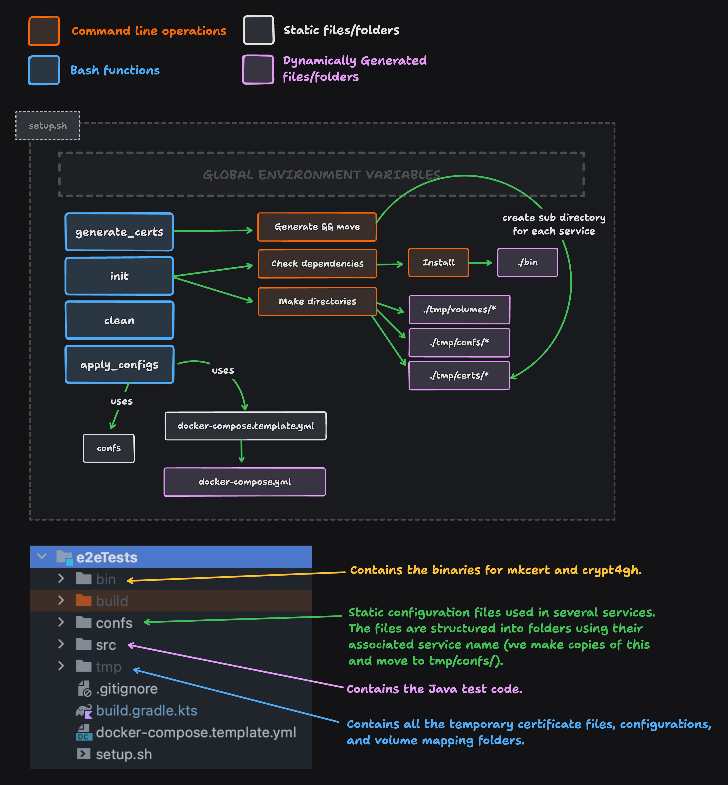

# E2E Test Setup

This Gradle submodule focuses on running the e2e test setup of
FEGA Norway. The following figure depicts the high-level overview
of how this setup works.



[Edit and export this figure at tldraw.com](https://www.tldraw.com/r/hQuNVXYht2-H6QRZcMh28?v=-3234,-969,4361,2023&p=page)

# Prerequisites

1. [Install `docker`](https://docs.docker.com/engine/install).
   - You must be able to run `docker` and `docker compose` without sudo
2. [Install `docker compose`](https://docs.docker.com/compose/install/) (usually it is bundled with Docker).
3. [Install Golang](https://go.dev/doc/install)
   - `curl -OJL https://go.dev/dl/go1.22.2.linux-amd64.tar.gz`
   - `rm -rf /usr/local/go && tar -C /usr/local -xzf go1.22.2.linux-amd64.tar.gz`
   - `export PATH=$PATH:/usr/local/go/bin`
4. [Install Java](https://www.java.com/en/download/help/download_options.html)
   - `sudo apt update`
   - `sudo apt install openjdk-21-jdk`
   - Also, ensure that the `JAVA_HOME` points to the correct version of JDK in your environment variables.
5. Make sure you have at least `8GiB` of free space on your machine.
 
# How to run the setup?

**To start the orchestration:**
```bash
# Navigate to the project root first.
# Then execute:
./gradlew start-docker-containers
```

**To stop the orchestration:**
```bash
./gradlew stop-docker-containers
```

# Troubleshooting

If the orchestration fail to start for some reason. We suggest trying the fixes below.

<details>
  <summary>I have conflicting containers. How do I remove them?</summary>

If for some reason it complaints about conflicting container
names, we suggest you manually remove those.

```bash
docker rm tsd db mq proxy interceptor postgres ingest verify finalize mapper doa cegamq cegaauth
```
</details>

<details>
  <summary>Docker complaints about port issues when running</summary>

The following ports **must** be free when running the setup.
`5432 5672 5433 80 5673 15672 25672` if any other service is
running please make sure you stop them.

```bash
lsof -ti:5432 -ti:5672 -ti:5433 -ti:80 -ti:5673 -ti:15672 -ti:25672 | xargs kill -9
```
</details>

<details>
  <summary>I made changes in `services/` but when I run latest are not there in the build</summary>

Try removing the stale images.

```bash
docker rmi tsd-proxy:latest tsd-api-mock:latest mq-interceptor:latest --force
```
</details>

<details>
  <summary>I have `docker-compose` but I can't find `docker compose` command?</summary>

In some cases, particularly on older Ubuntu distributions, you might find that you have `docker-compose` (V2) installed but not the `docker compose` subcommand. To resolve this, first ensure you have Compose V2 and then, you can create a symbolic link in the `cli-plugins` directory by executing the following commands:

```bash
mkdir -p ~/.docker/cli-plugins
ln -sfn /usr/local/bin/docker-compose ~/.docker/cli-plugins/docker-compose
```

For migration guidance to Docker Compose, visit [migrate to docker compose](https://docs.docker.com/compose/migrate/). Also, for further discussions and troubleshooting, refer to the GitHub issue at https://github.com/docker/compose/issues/8630.
</details>

<details>
  <summary>Docker fails to build mq-interceptor (dial tcp: lookup proxy.golang.org: i/o timeout) </summary>

Do a docker daemon restart.

```bash
sudo systemctl restart docker
```
</details>

<details>
  <summary>I made a mess. I want to start from scratch.</summary>

First, clean the e2eTests directory and all the submodules.

```bash
sudo rm -rf e2eTests/tmp e2eTests/bin docker-compose.yml &&
./gradlew clean
```

And then let's prune the docker system and restarts the docker daemon.

```bash
docker stop $(docker ps -aq) && \
docker rm $(docker ps -aq) && \
docker rmi tsd-proxy:latest tsd-api-mock:latest mq-interceptor:latest --force && \
lsof -ti:5432 -ti:5672 -ti:5433 -ti:80 -ti:5673 -ti:15672 -ti:25672 | xargs kill -9 \
echo 'y' | docker system prune &&
sudo systemctl restart docker
```
</details>
