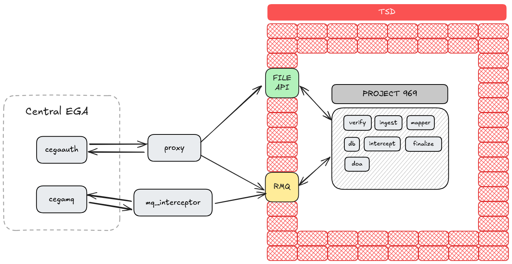
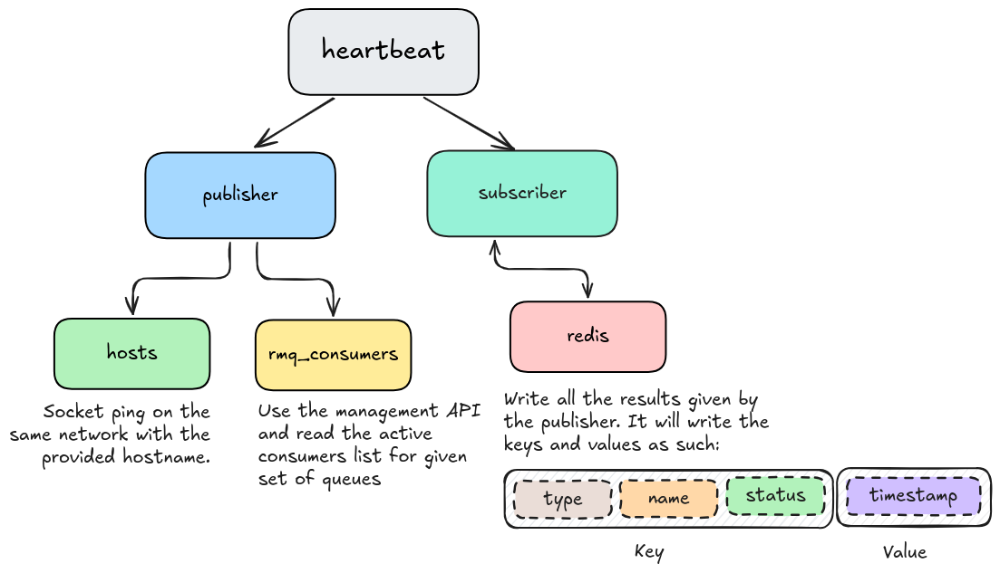
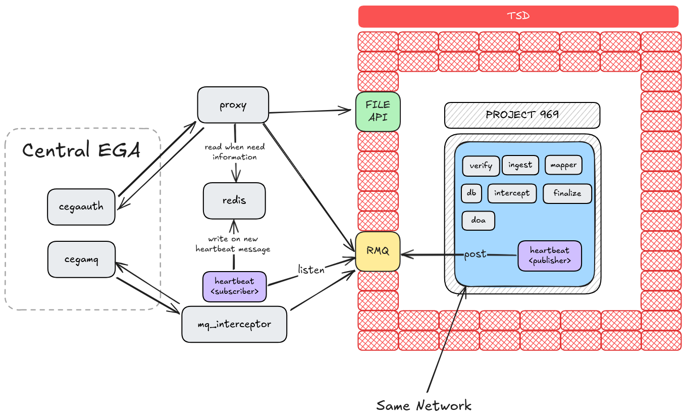

# Heartbeat Service and Subscriber Application

This project provides a service that publishes heartbeat messages to a RabbitMQ queue and a subscriber that processes those messages to monitor the health of multiple services.

## Table of Contents

1. [Overview](#overview)
2. [Architecture](#architecture)
3. [Features](#features)
4. [Getting Started](#getting-started)
5. [Configuration](#configuration)
6. [Running the Application](#running-the-application)

---

## Overview

This application consists of two main components:

- **Publisher**: Sends heartbeat messages at a defined interval, containing the status of services and RabbitMQ consumers.
- **Subscriber**: Consumes these messages, processes them, and stores the overall health based on the received heartbeats.

We assume the publisher is running inside a secluded environment (like TSD) where the only way in and out is via
RabbitMQ messages. Thinking that, the setup makes much more sense.



## Architecture

The architecture consists of:

- A **publisher** that reads from configuration files to determine the hosts and RabbitMQ consumers it monitors.
- A **RabbitMQ queue** used to send and receive heartbeat messages.
- A **subscriber** that reads messages from the queue and processes the heartbeat information.
- **Redis** is used as a shared state store between the proxy and the subscriber for tracking the latest statuses.



Ideally you'd deploy it like this: -



You don't need additional configurations on your RabbitMQ instance as it will create the queues and create
the bindings if not exists. This applies to both subscriber and publisher. Regardless who runs first it will
create if not exists.

## Features

- **Heartbeat Monitoring**: The publisher sends regular heartbeat messages with host and consumer statuses.
- **Configurable**: Both publisher and subscriber can be configured using external files and environment variables.
- **Integration with Redis**: The system uses Redis to store and retrieve heartbeat information.

> Note that this codebase **does not automatically create the Redis and RabbitMQ instances**. It assumes they are
> already up and healthy. It requires the configurations to connect to those instances.

## Getting Started

### Prerequisites

Ensure you have the following installed:

- Python 3.8+
- Docker
- RabbitMQ
- Redis
- A suitable text editor (e.g., VSCode)

### Clone the Repository

Clone this repository to your local machine.

```bash
git clone https://github.com/ELIXIR-NO/pipeline-heartbeat.git
cd heartbeat-service
```

### Set Up Virtual Environment

```bash
python3 -m venv venv
source venv/bin/activate # On Windows, use venv\Scripts\activate
```

### Install Dependencies

```bash
pip install -r requirements.txt
```

## Configuration (Common for both pub/sub)

```bash
export HEARTBEAT_MODE=publisher # or subscriber
export RABBITMQ_HOST=
export RABBITMQ_PORT=5672
export RABBITMQ_USER=
export RABBITMQ_PASS=
export RABBITMQ_VHOST=
export RABBITMQ_EXCHANGE=
export RABBITMQ_QUEUE=
export RABBITMQ_ROUTING_KEY=
export RABBITMQ_TLS=
export RABBITMQ_CA_CERT_PATH=
export RABBITMQ_TLS_PORT=5671
export PUBLISH_INTERVAL=60
export RABBITMQ_MANAGEMENT_PORT=15671
export REDIS_HOST=redis
export REDIS_PORT=6379
export REDIS_DB=0
```

## Run the application

```bash
python heartbeat.py
```
